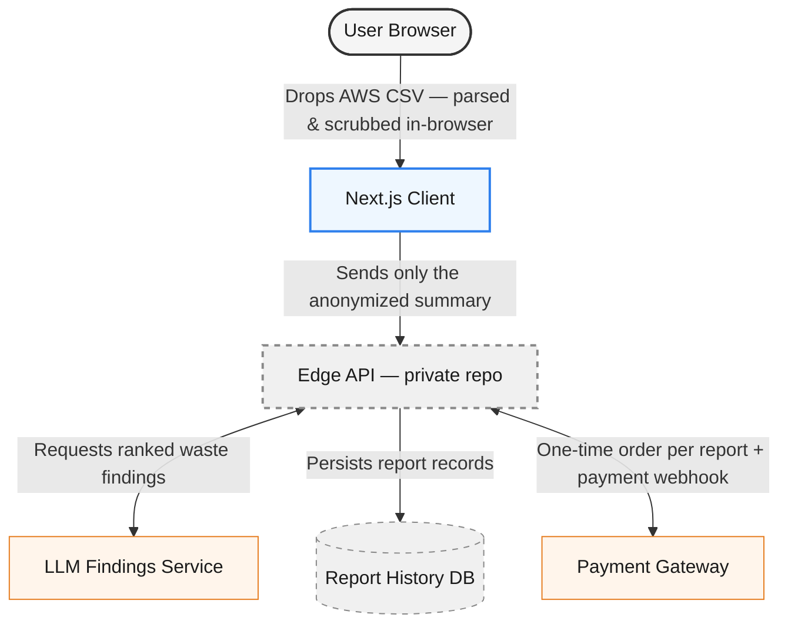

# LeanMoth

**See exactly what's standing between you and your AWS cloud cost — without ever uploading your AWS billing file.**

LeanMoth reads and analyzes your AWS Cost & Usage report entirely in your browser, finds specific, ranked data-transfer waste (cross-AZ chatter, idle Elastic IPs, public-IP-routed internal traffic, and more), and — if you've run a report before — shows whether what you fixed last time actually worked. The raw CSV never leaves your machine; only an anonymized, aggregated summary is sent to the backend. This repository is the client — it's public specifically so that claim doesn't have to be taken on faith. Read `src/features/ingestion/parser.ts` yourself.

Pay per report, flat fee — no subscription.

---

## Why this repo is public

Most cost-analysis tools ask you to upload a CSV full of account IDs, resource names, and spend data to a server you don't control. LeanMoth's core pitch is that it doesn't have to work that way — parsing and PII-scrubbing happen client-side, in memory, before anything is transmitted.

That's an easy claim to make and a hard one to trust from marketing copy alone. So the client is open for inspection. The backend (payments, database, AI orchestration) stays private — there's no privacy benefit to publishing it, and it's the part of the business worth protecting.

No license is granted on this code. It's here to be read, not reused — see [License](#license).

---

## Architecture



The dashed nodes (edge API, report history DB) live in a private repository and aren't part of this codebase — shown here only for context on where the anonymized summary goes after it leaves the browser.

---

## Stack

| Layer        | Choice                                                                                                                 |
| ------------ | ---------------------------------------------------------------------------------------------------------------------- |
| Framework    | Next.js, static export                                                                                                 |
| Charts       | Recharts                                                                                                               |
| Language     | TypeScript, strict mode                                                                                                |
| API contract | Generated types from the backend's Hono RPC definitions — no hand-maintained interface drift between client and server |
| Testing      | Vitest + Happy DOM                                                                                                     |
| Hosting      | Cloudflare Pages                                                                                                       |

---

## Engineering practices

- **Pure functional core.** All parsing and calculation logic (`features/*/parser.ts`, etc.) is framework-agnostic — no React, no network calls — so it's unit-testable in isolation and easy to audit for exactly what data it touches.
- **Type-safe client/server contract.** The API shape is generated from the backend's route definitions at build time, not hand-written — a backend change that breaks the contract fails the frontend typecheck instead of failing silently at runtime.
- **Enforced on every commit, not just in CI.** Prettier, ESLint, and `tsc --noEmit` run via Husky + lint-staged pre-commit, so the main branch never carries a formatting or type regression.
- **No floating promises.** Every async boundary is either awaited-and-handled or explicitly fire-and-forgot on purpose — enforced by lint rule, not convention.

---

## Local development

```bash
git clone https://github.com/<your-username>/leanmoth-console.git
cd leanmoth-console
npm install
npm run dev
```

The app runs fully against mock/local data — no backend credentials are required to explore the UI or the parsing logic.

---

## License

This repository is public so its client-side privacy claims can be independently verified. **No license is granted.** All rights reserved — viewing and forking on GitHub is permitted by GitHub's own terms, but reuse, redistribution, or derivative works (commercial or otherwise) are not authorized.
